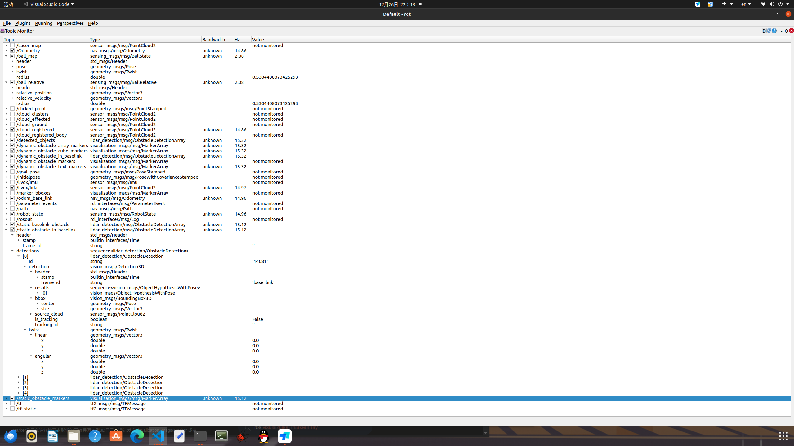
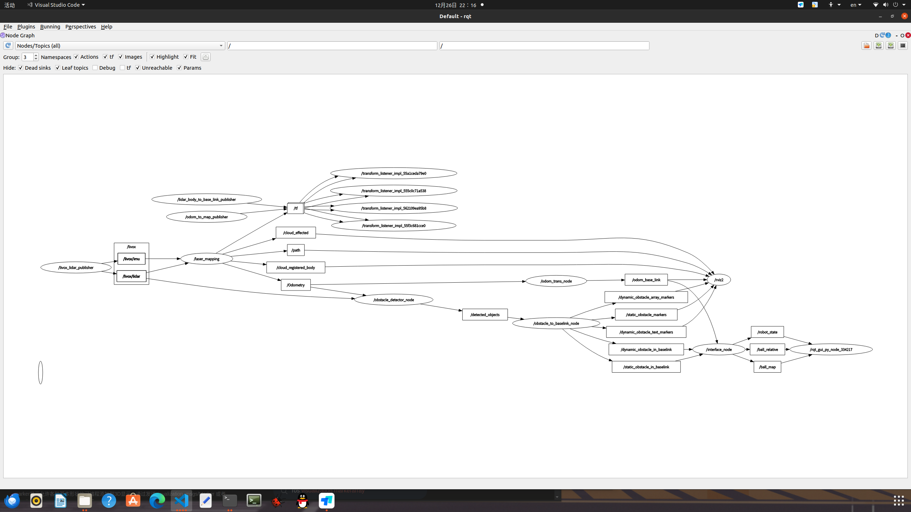

# Changelog for lidarDetection
主要区分了动态物体和静态物体,在rviz中将动态物体显示为红色,静态物体显示为绿色.并且动态物体会显示速度矢量.具体方法是将障碍框出的bbox转到map坐标系下进行区分,代码可见`obstacle_information_to_baselink.cpp`中.

/livox/lidar的点云数据,经过roi_filter和voxel_grid_filter之后,点云数量大概在400~600之间,具体数量与livox_ros_driver2的发布频率有关,见下表:

当调整livox_ros_driver2的发布频率时,/livox/lidar发布,由obstacle_detector_node节点接收的点云频率如下表所示,目前/livox/lidar的发布频率调成了15Hz:

| publish_freq |actual_publish_freq| pointcloud_num_per_frame |
|--------------|-------------------|--------------------------|
| 20.0         | 17.11             | Raw points: 9888         |
| 10.0         | 8.55 - 7.多       | Raw points: 19768        |
| 15.0         | 12.77- 13.76      | Raw points: 13252        |



节点及其连接图:


`lidarSORT`代码属于ROS1改编自ROS2,目前仍然不能够运行,功能与`lidar_detection`类似.对于`lidar_detection`的下游接口而言,障碍物分为了两个话题进行发布:

```
    // 输入的球相对位置话题,目前使用的是dynamic_obstacle_to_baselink的话题,将所有动态障碍物当作"球"处理了,后续需要调整成真正的球检测话题.
    input_relative_ball_topic_ =
      this->declare_parameter<std::string>("input_relative_ball_topic", "/dynamic_obstacle_in_baselink");
    output_relative_ball_topic_ = this->declare_parameter<std::string>("output_relative_ball_topic", "/ball_relative");

    // 静态障碍物
    input_static_obstacle_topic_ =
      this->declare_parameter<std::string>("input_static_obstacle_topic", "/static_obstacle_in_baselink");
    output_static_obstacle_topic_ =
      this->declare_parameter<std::string>("output_static_obstacle_topic", "/static_baselink_obstacle");
```
对应的代码改动可以在`lidar_detection/src/interface.cpp`中查看.

调试需要`livox_ros_driver2`的lidar ip被修改了,拉取的时候记得修改回go2身上的mid360的ip.还有就是yaml配置文件中也做了相应的修改,可以在`lidar_detection/config/go2.yaml`中查看,相关的参数调节可以参考`go2.yaml`中的注释说明.

如果有什么漏写的可以及时联系~