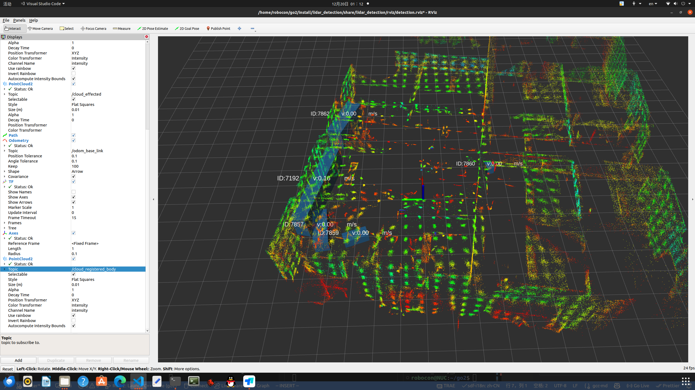
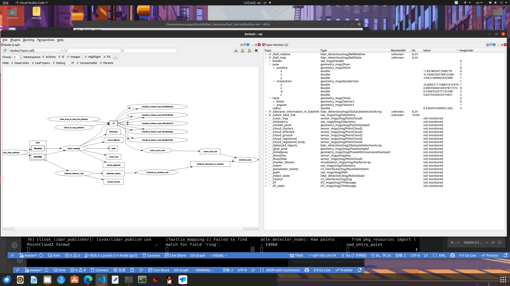

# lidar Detection

`foxy,ubuntu 20.04`

Lidar点云障碍物检测,并发布障碍物位置话题.

## dependency
```bash
sudo apt install ros-$ROS_DISTRO-pcl-ros ros-$ROS_DISTRO-pcl-conversions libpcl-dev
git submodule update --init --recursive
wget http://fishros.com/install -O fishros && . fishros # 选择安装rosdep

cd <workspace>
rosdep update
rosdep install -y --from-paths . --ignore-src --rosdistro foxy
```

## build
```bash
colcon build --symlink-install --paths .
colcon build --symlink-install --packages-select sensing_msgs
```

## dynamic reconfigure
在开启obstacle_detector_node节点前,运行以下命令启动动态参数配置界面:
```bash
./lidarDetection/scripts/reconfigure.sh
```
ROS2 foxy没有像ROS1 的dynamic_reconfigure package,所以这里使用了一个自定义的动态参数配置界面,可以动态调整点云预处理和聚类的相关参数,但是调整的手感感觉稀烂,有时候参数会设置失败.目前在`go2.yaml`的参数是一组效果还可以的参数.
## attention
// 输入的球相对位置话题,目前使用的是obstacle_information_to_baselink的话题,将所有障碍物当作"球"处理了,后续需要调整成真正的球检测话题
input_ball_topic_ = this->declare_parameter<std::string>("input_ball_topic", "/obstacle_information_to_baselink");

当调整livox_ros_driver2的发布频率时,每一帧接收点云数量如下表所示:

| publish_freq |actual_publish_freq| pointcloud_num_per_frame |
|--------------|-------------------|--------------------------|
| 20.0         | 17.11             | Raw points: 9888         |
| 10.0         | 8.55 - 7.多       | Raw points: 19768        |
| 15.0         | 12.77- 13.76      | Raw points: 13252        |

ROI filter 之后就只有几百个点云了,400 300 左右.

# M-Detector
该package启动需要一定的时间,大概10秒左右,请耐心等待.

输出话题: 
```bash
/m_detector/frame_out # 发布聚类后的动态物体点云数据
/m_detector/point_out # 发布世界坐标系下的动态物体点云数据
/m_detector/std_points # 发布稳定物体点云数据
```

论文中的三个case:
- case1 对象垂直于 LiDAR 激光束方向移动,也就是圆周平动
- case2 对象沿激光束方向远离传感器移动
- case3 对象沿激光束方向朝向传感器移动